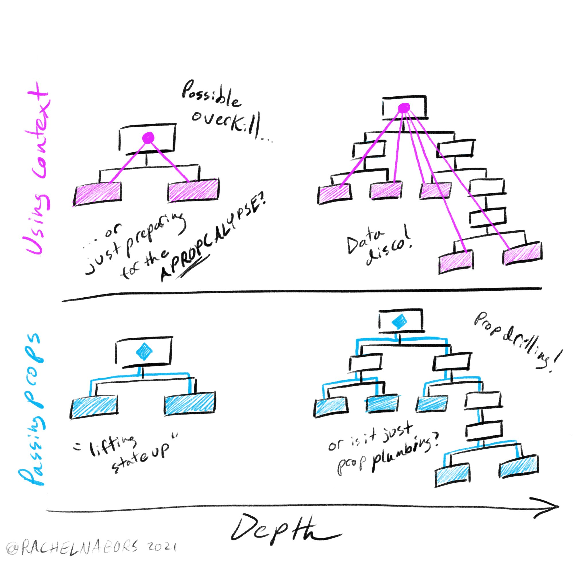
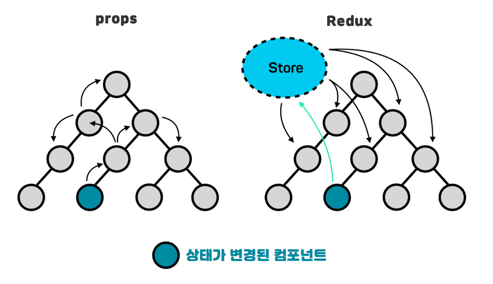

# Redux

## Redux 소개

React는 부모에서 자식으로 데이터를 넘기는 흐름이기 때문에 최상위 컴포넌트에서 밑으로 들어갈 수록 props가 전달이 되고, 이게 나중에는 어디서 참고하는지 모르는 지경에 까지 이르게 됩니다.

너무 많이 props를 전파해서 어디까지 이어지는지 모르는 경우를 props-drilling이라고 합니다.

마치 props가 자식으로 계속 전달이 되는 것이 드릴을 뚫는 것과 같다고 해서 붙혀진 별명입니다.



드릴링 이미지의 아래 passing props를 보면 최상위에서 하위로 갈수록 많은 컴포넌트를 거쳐야 하는 것을 알 수 있습니다.

그렇다면 우리가 알고리즘에서 for문을 풀 때 특정한 값을 따로 저장하고 싶을 때 for문의 밖에다가 새로운 변수를 만들고, 그 변수에 값을 넣는 것 처럼 React에서 어딘가에 우리가 Props로 넘겨줄 데이터를 저장하고 필요한 곳에서 꺼내어 쓰면 되지 않을까? 라는 것에서 출발한 것이 Redux의 기본 개념입니다.



Redux의 3가지 원칙은 다음과 같습니다.

1. 하나의 근원으로부터
   - 애플리케이션의 모든 상태는 하나의 저장소 안에 하나의 객체 트리 구조로 저장됩니다.
2. 상태는 읽기 전용이다
   - 상태를 변화시키는 유일한 방법은 무슨 일이 벌어지는 지를 묘사하는 액션 객체를 전달하는 방법뿐입니다.
3. 변화는 순수 함수로 작성되어야한다
   - 액션에 의해 상태 트리가 어떻게 변화하는 지를 지정하기 위해 프로그래머는 순수 리듀서를 작성해야합니다.

## Redux를 안써야하는 경우

작은 프로젝트의 경우에는 Hook에서 useContext와 같은 기능을 이용하여 redux를 대체할 수 있습니다.

그러므로 닭 잡는데에 소 잡는 칼을 쓰지 않기 위해 소규모 프로젝트에서는 redux를 쓰지 않는것이 오히려 좋습니다.

기능이 많다는 것은 그만큼 용량이 크고, 이 모듈을 불러오고, 사용하기 위해서 많은 리소스를 사용해야한다는 뜻입니다. 그러므로 큰 프로젝트가 아닌 간단한 To-Do list만들기와 같은 간단한 프로젝트는 redux를 쓰지 않습니다.

## Redux의 기본 개념

리덕스의 기본 개념은 다음 이미지와 같습니다.


하나의 스토어를 만들고 스토어에서 상태를 관리합니다. 그리고 사용자가 어떠한 액션을 발생하면 액션이 리듀서라고 불리는 함수에 전달이 되고 리듀서가 스토어에 있는 값을 업데이트 하게 됩니다.

그러면서 스토어에 있는 값이 바뀌었기 때문에 서브스크립트가 컴포넌트에 값이 바뀌었다는 것을 전달하게 됩니다.

## 간단한 예제

우리는 이제부터 간단한 가감기(더하고 빼는 기능을 가진 계산기)를 만들어주려 합니다.

자 기존에 10장에서 했던 폴더를 복사 해 오고, 해당 폴더에서 index와 App을 제외한 나머지는 삭제 한 뒤 시작 하겠습니다.

이제 모듈을 설치 해 봅시다.

```bash
npm install @reduxjs/toolkit react-redux
```

@reduxjs/toolkit은 redux와 관련된 여러 편리한 기능을 제공해 주어 필수로 설치를 해 주어야 합니다.
react-redux는 리덕스에 대한 기본 코드가 들어있습니다

모듈을 설치 한 뒤 제일 처음 해야할 것은 Redux Store를 만들어 주어야 합니다. 스토어는 따로 구분하기 쉽게 src폴더 아래에 app안에 넣어 줍니다.

그리고 configStore라는 것을 이용하여 스토어를 정의 해 줍니다.

> src/app/store.js

```javascript
import { configureStore } from "@reduxjs/toolkit";

export default configureStore({
  reducer: {},
});
```

Redux toolkit의 기본 기능인 configureStore는 스토어에 대한 정의를 안에 자동으로 생성 해 줍니다.

자 이제 react에 우리가 redux를 사용한다고 전달 해 주어야 합니다.

전달하는 방법은 아래와 같습니다.

> src/index.js

```javascript
import React from "react";
import ReactDOM from "react-dom/client";
import "./index.css";
import { Provider } from "react-redux"; // react-redux의 Provider를 import 합니다.
import App from "./App";
import store from "./app/store"; // 우리가 방금 만들었던 stroe를 improt 합니다.

const root = ReactDOM.createRoot(document.getElementById("root"));
root.render(
  <Provider store={store}>
    // 렌더를 하는 부분에 Provider를 추가 하고, store로는 방금 만든 store를 넣어
    줍니다.
    <App />
  </Provider>
);
```

자 이제 react에 redux를 사용한다고 전달 했고, 스토어로는 /src/app/store를 사용 할 것이라고 하였습니다.

이제 redux의 상태를 바꿀 수 있는 기능을 만들어 주려 합니다.

우선 카운터 기능을 만들기 때문에 새로운 파일을 하나 만들어 줍시다.

> src/feature/counterSlice.js

```javascript
/* eslint-disable no-param-reassign */
import { createSlice } from "@reduxjs/toolkit";

// createSlice는 action과 reducer를 한번에 생성 해 줍니다.
export const counterSlice = createSlice({
  name: "counter", // 이름을 설정 해 줍니다.
  initialState: {
    // 기본 값을 설정 해 줍니다.
    value: 0,
  },
  reducers: {
    // 리듀서의 기능에 대해서 정의 합니다.
    // 원래 파라미터로 받은 값을 수정하는 것은 옳지 않습니다. 하지만 toolkit이 이를 자동으로 처리 해 줍니다.
    // 1씩 증가 하는 리듀서 기능입니다.
    increment: (state) => {
      state.value += 1;
    },
    // 1씩 감소 하는 리듀서 기능입니다.
    decrement: (state) => {
      state.value -= 1;
    },
    // 특정 값을 기준으로 증감 하는 리듀서 기능입니다.
    incrementByAmount: (state, action) => {
      state.value += action.payload;
    },
  },
});

// 각각의 리듀서 기능에 맞추어 액션을 만들어 줍니다.
export const { increment, decrement, incrementByAmount } = counterSlice.actions;

// 방금 만든 slice의 reducer를 기본으로 export 합니다.
export default counterSlice.reducer;
```

이제 리듀서를 만들었으니 store에 추가 해 줍시다.

> src/app/store.js

```javascript
import { configureStore } from "@reduxjs/toolkit";
// counterSlice.reducer가 기본값으로 export된 것을 받습니다.
import counterReducer from "../feature/counterSlice";

export default configureStore({
  reducer: { counterReducer },
});
```

자 이제 reducer를 사용할 준비가 완료 되었습니다.

본격적으로 src/App.js에서 작업 해 봅시다.

> src/App.js

```javascript
import React from "react";
import { useSelector, useDispatch } from "react-redux";
import { decrement, increment } from "./feature/counterSlice";
import "./App.css";

function App() {
  // 스토어에서 원하는 값을 선택하여 가지고 올 수 있습니다.
  // counterSlice에서 initValue로 만든 value를 가지고 옵니다.
  const count = useSelector((state) => {
    return state.counterReducer.value;
  });
  // useDispatch를 변수에 넣어서 사용한다.
  // counterSlice에서 선언 했던 increment와 decrement를 사용 할 수 있게 되었다.
  const dispatch = useDispatch();

  return (
    <div>
      <button
        type="button"
        onClick={() => {
          // 디스패치를 선언 한 후 리듀서를 호출 해 준다.
          dispatch(increment());
        }}
      >
        +
      </button>
      <span>{count}</span>
      <button
        type="button"
        onClick={() => {
          // 디스패치를 선언 한 후 리듀서를 호출 해 준다.
          dispatch(decrement());
        }}
      >
        -
      </button>
    </div>
  );
}

export default App;
```

redux를 사용하여 간단한 가감기를 만들어 보았습니다.

기존에 props를 전달하여 사용 하는 것 보다 뭔가 한 곳에 데이터를 저장 할 수 있고, 함수들을 불러와서 사용하는 것에 있어서 부모를 찾아보지 않고 바로 store나 slice에서 찾아 볼 수 있어서 편리하게 사용 할 수 있습니다.

redux는 우리가 지금 사용한 것이 기능의 끝은 아니지만 대략적인 개념을 이해 할 수 있습니다!
